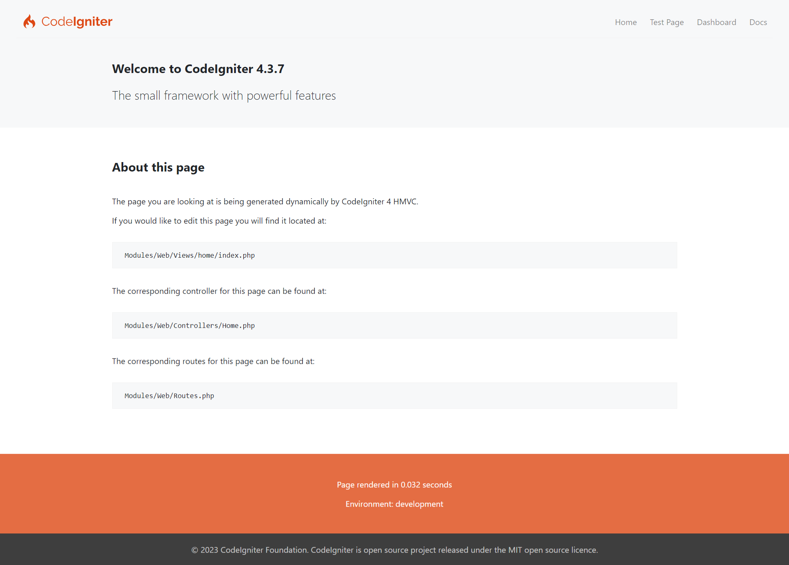
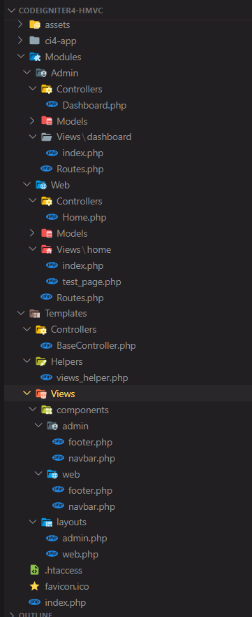

# Codeigniter4-HMVC

This is my version of Hierarchical model–view–controller (HMVC) project starter using CodeIgniter4 framework.

### Screenshot Example



<br/>

## HMVC Structure
### Default Structure
By default, there is the structure of Codeigniter4-HMVC 

```
assets
    \{YourFolderCSSAssets}
ci4-app
    \DefaultFilesForCodeIgniter4
Modules
    \{YourModule}
        \Controllers
            {YourController}.php
        \Models
            {YourModel}.php
        \Views
            {YourView}.php
        Routes.php
Templates
    \Controllers
        {BaseController}.php
    \helpers
        {YourCustomHelper}.php
    \components 
        {YourViewComponents}.php
    \layouts
        {YourViewLayout}.php
```

### Screenshot Folder



### Custom Structure

You can structuring your module freely, because CodeIgniter4 use PSR4. 
If you want to change the structure of Routes.php in Config Module folder or the structure of Module Controllers, you must change app/Config/Routes.php in HMVC

## Contribute

You can contribute for extend CodeIgniter4 capabilities or add command prompt for development use by fork this repository. After that, you can make pull request.